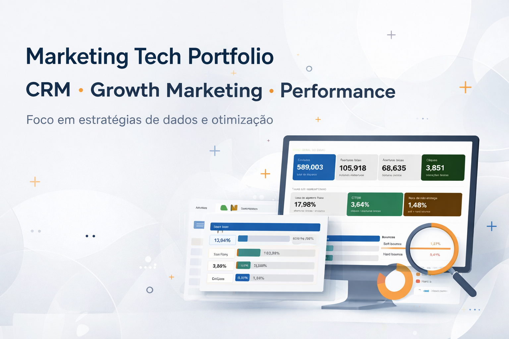

# 👩‍💻 Aline Rosário

Projetos aplicados em **SEO técnico, arquitetura de informação, mídia paga e estratégia digital**, com foco em crescimento estruturado, mensurável e escalável.

---

## ⚡ Competências & Ferramentas

SEO Técnico • Arquitetura de Informação • Estratégia Digital • Google Search Console • GA4 • Google Tag Manager • Google Ads • Meta Ads • Looker Studio • CRM • Tracking • GitHub

---

## 🚀 Cases

### 🧭 Arquitetura de Páginas e SEO Técnico | Milvus

**Foco:** reestruturação de páginas institucionais, comerciais, comparativas, de segurança e recursos para um site B2B SaaS  
**Resultado:** nova arquitetura orientada à jornada do usuário, SEO técnico, confiança, prova social e apoio à conversão

Páginas idealizadas:

- Sobre a Milvus
- Central de Confiança
- Help Desk com WhatsApp
- Cases
- Preços
- Comparativos
- Recursos

➡️ [Ver case completo](https://github.com/alinerodriguesrosario-lgtm/marketing-tech-portfolio-/blob/Main/PROJETOS/milvus-arquitetura-paginas)

---

### 📊 CRM Performance Optimization | FEMME

**Foco:** análise estratégica de CRM com foco em performance e otimização  
**Resultado:** leitura de dados para apoiar decisões de relacionamento, ativação e melhoria de performance

👉 [Ver projeto completo](https://github.com/alinerodriguesrosario-lgtm/marketing-tech-portfolio-/blob/Main/PROJETOS/femme-crm-performance)

---

### 🔍 SEO Técnico | Grupo Cecil

**Foco:** indexação, arquitetura e rastreabilidade  
**Resultado:** base estruturada para crescimento orgânico e melhoria de crawling

➡️ [Ver case completo](https://github.com/alinerodriguesrosario-lgtm/marketing-tech-portfolio-/blob/Main/grupo-cecil-seo)

---

### 🚀 Performance Integrada | São Lucas

**Foco:** leitura cruzada entre Meta Ads e Google Ads  
**Resultado:** melhor alocação de investimento e apoio à conversão

➡️ [Ver case completo](https://github.com/alinerodriguesrosario-lgtm/marketing-tech-portfolio-/blob/Main/sao-lucas-estrategia)

---

### 📈 Google Ads | Conversão

**Foco:** captura de demanda e qualificação de tráfego  
**Resultado:** redução de desperdício e ganho de eficiência

➡️ [Ver case completo](https://github.com/alinerodriguesrosario-lgtm/marketing-tech-portfolio-/blob/Main/google-ads-performance)

---

### 📊 Meta Ads | Aquisição

**Foco:** segmentação e construção de audiência  
**Resultado:** aumento da eficiência de alcance e geração de interesse

➡️ [Ver case completo](https://github.com/alinerodriguesrosario-lgtm/marketing-tech-portfolio-/blob/Main/meta-ads-aquisicao)

---

## 🧠 Abordagem

Marketing não é campanha isolada.

Estruturo com base em:

- Jornada do usuário
- Dados confiáveis e rastreáveis
- Arquitetura clara de páginas e canais
- Integração entre SEO, mídia paga, conteúdo e CRM
- Otimização contínua

Campanha sem estrutura roda.  
Mas não escala.

---

## 👩‍💻 Sobre

Profissional de **Comunicação, Branding e Marketing Digital**, com atuação em:

- SEO técnico
- Arquitetura de informação
- Performance em Google Ads e Meta Ads
- Estratégia digital
- Análise de métricas
- Tracking e estruturação de dados para marketing

Transformo marcas em sistemas digitais mais **consistentes, mensuráveis e escaláveis**.

🎓 Especialista em Mídia, Informação e Cultura — ECA/USP

---

## 📬 Contato

- 💼 [LinkedIn](https://www.linkedin.com/in/alinerosario/)
- 🎨 [Behance](https://www.behance.net/alinerosario)
- 📧 aline.rodrigues.rosario@gmail.com
