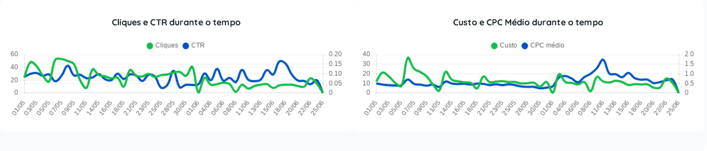
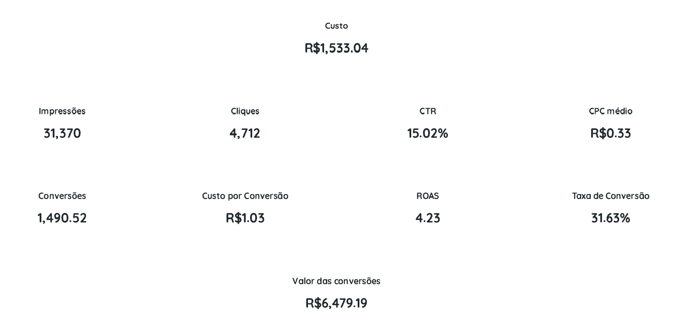
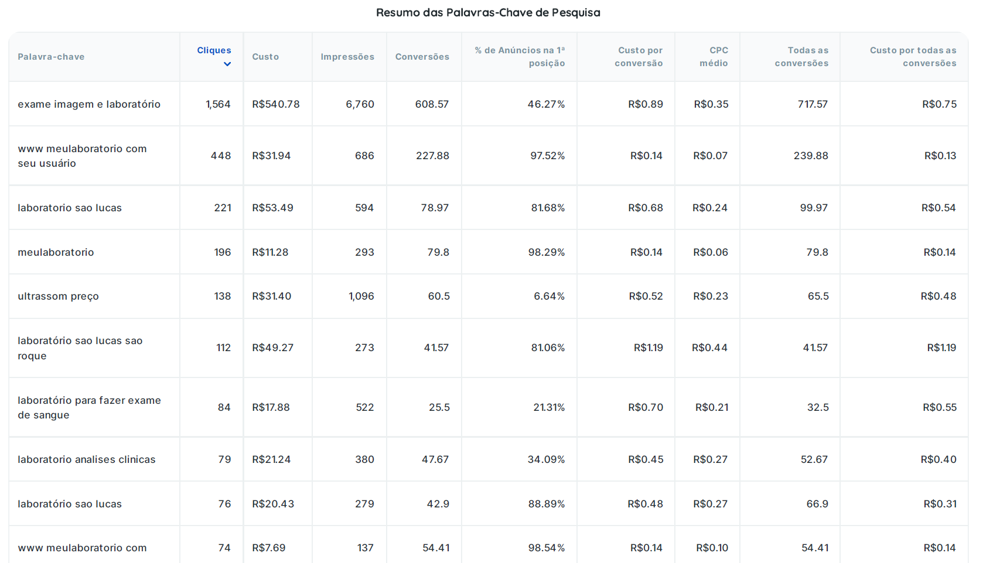
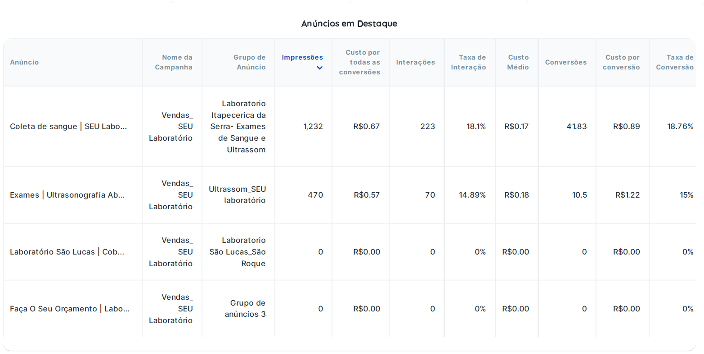
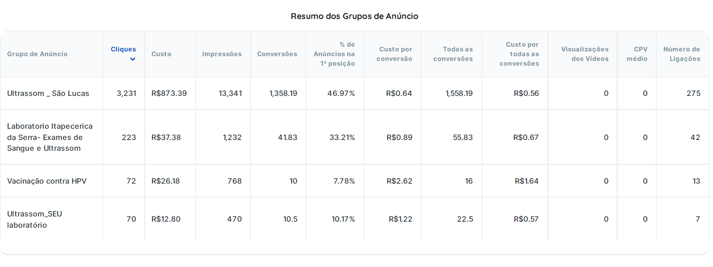
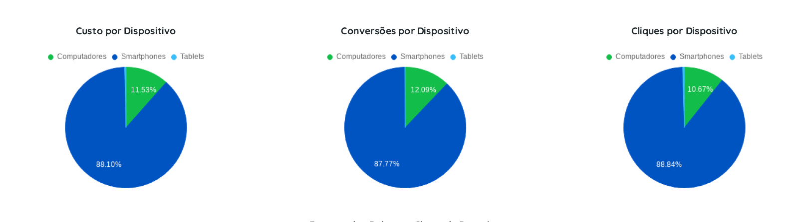
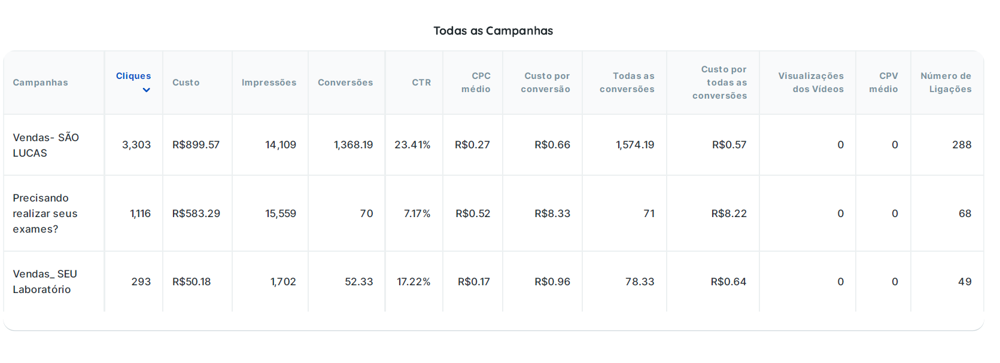

# 🔎 Case – Google Ads | Performance de Conversão  
**Cliente:** São Lucas (Serviços laboratoriais)

---

## 🎯 Objetivo
Gerar conversões para exames laboratoriais, com foco em intenção de busca e eficiência de aquisição.

---

## 📊 Resultados Gerais

- **Investimento total:** R$1.533,04  
- **Impressões:** 31.370  
- **Cliques:** 4.712  
- **CTR:** 15,02%  
- **CPC médio:** R$0,33  

---

## 💰 Performance de Conversão

- **Conversões:** 1.490  
- **Taxa de conversão:** 31,63%  
- **Custo por conversão:** R$1,03  
- **Valor das conversões:** R$6.479,19  
- **ROAS:** 4,23  

---

## 📈 Principais Insights

### 🔍 Intenção de Busca Bem Trabalhada
- CTR elevado (15%) indica forte alinhamento entre:
  - Palavra-chave  
  - Anúncio  
  - Intenção do usuário  

📌 Tradução:  
O anúncio aparece exatamente quando a pessoa já quer resolver o problema.

---

### 🚀 Alta Eficiência de Conversão
- Taxa de conversão acima de 30%  
- Custo por conversão extremamente baixo (R$1,03)

📌 Insight:  
Estrutura de campanha + landing page bem alinhadas

---

### 💡 Escala com Rentabilidade
- ROAS 4,23 → retorno consistente  
- Potencial claro de aumento de investimento  

---

## 🔑 Performance de Palavras-chave

### Destaques:

- **"exame imagem e laboratório"**
  - Alto volume de cliques  
  - Forte geração de conversões  

- **Termos de marca ("laboratório são lucas")**
  - Alta taxa de conversão  
  - CPC baixo  

📌 Insight:
- Mix eficiente entre **palavras genéricas + marca**

---

## 📊 Estrutura de Campanhas

### Campanha de maior performance:
**Vendas – São Lucas**

- CTR: 23,41%  
- Taxa de conversão: 41,42%  
- Custo por conversão: R$0,66  

📌 Insight:  
Campanha altamente otimizada para fundo de funil

---

### Segmentação por dispositivo

- Maioria das conversões via **smartphone (~88%)**

📌 Insight:  
Experiência mobile é fator crítico para conversão

---

## ⚠️ Pontos de Atenção

- Algumas campanhas com:
  - CTR menor (7%)  
  - Custo por conversão mais alto  

📌 Indica:
- Necessidade de refinamento de:
  - Palavras-chave  
  - Segmentação  
  - Copy do anúncio  

---

## 💡 Oportunidades de Otimização

### 🔧 Estrutura
- Separar campanhas por intenção:
  - Pesquisa genérica  
  - Marca  
  - Serviços específicos  

---

### 🎯 Palavras-chave
- Expandir termos de alta conversão  
- Negativar termos irrelevantes  

---

### 💰 Lances
- Ajuste de bids para:
  - Palavras mais rentáveis  
  - Horários de maior conversão  

---

### 📱 Experiência
- Otimização contínua para mobile  
- Redução de fricção na conversão  

---

## 🧠 Conclusão

A estratégia de Google Ads apresentou **alto nível de eficiência e maturidade**, com forte alinhamento entre intenção de busca e conversão.

Os resultados indicam uma operação estruturada, com **baixo custo por aquisição e alto retorno**, além de potencial claro de escala com manutenção de rentabilidade.

---

## 🖼️ Evidências Visuais

### 📈 Cliques, CTR e CPC ao longo do tempo

---

### 📊 Resumo da campanha

---

### 🔑 Palavras-chave

---

### 📢 Anúncios em destaque

---

### 📊 Grupos de anúncios

---

### 📱 Dispositivos

---

### 📈 Todas as campanhas

