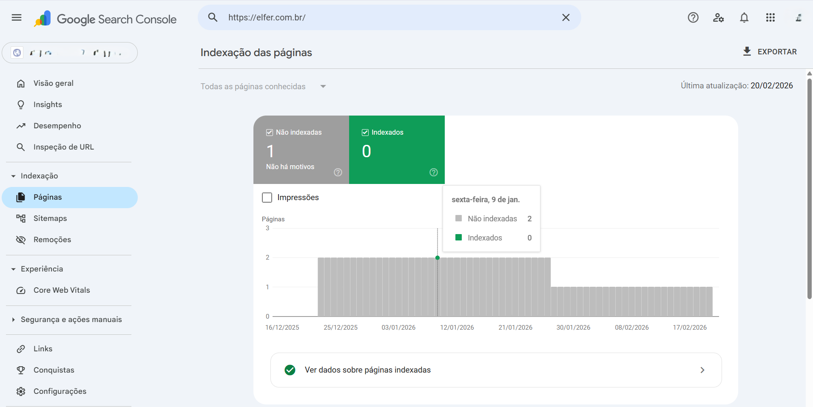
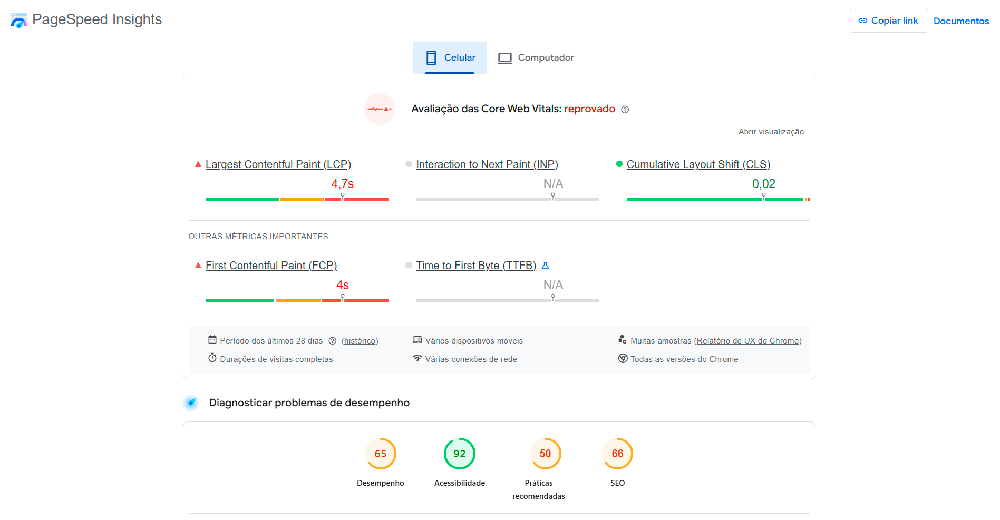
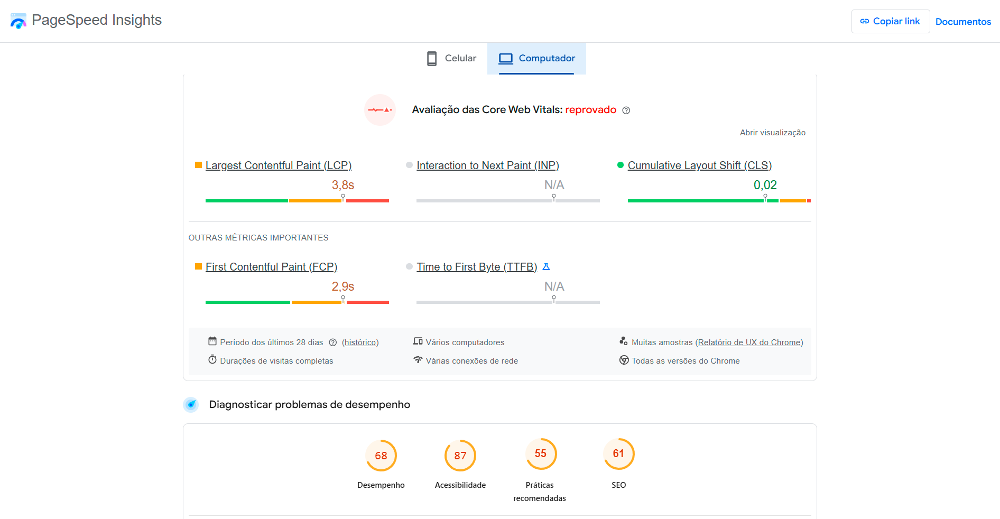
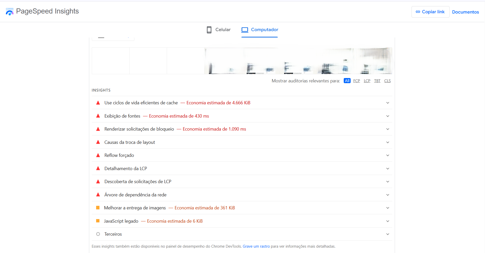
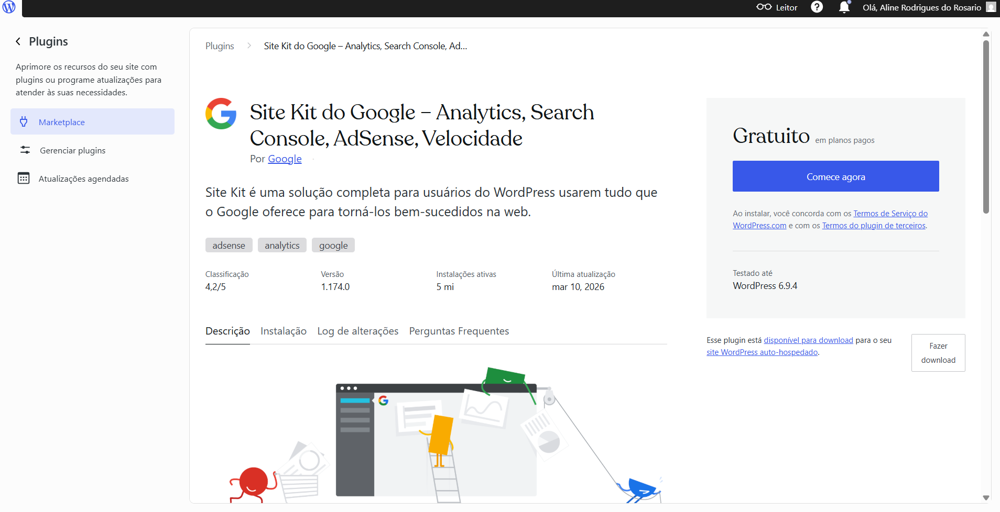
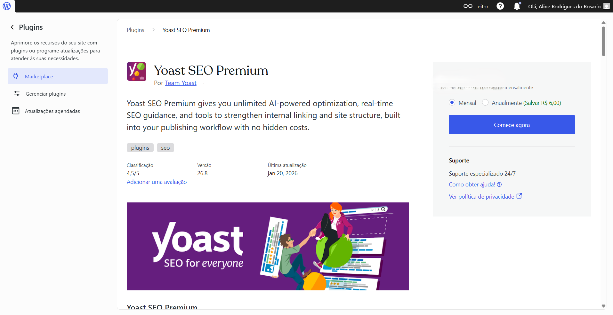
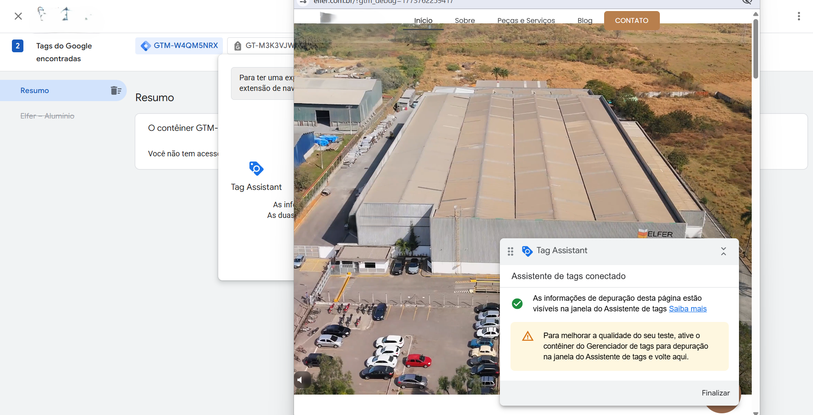
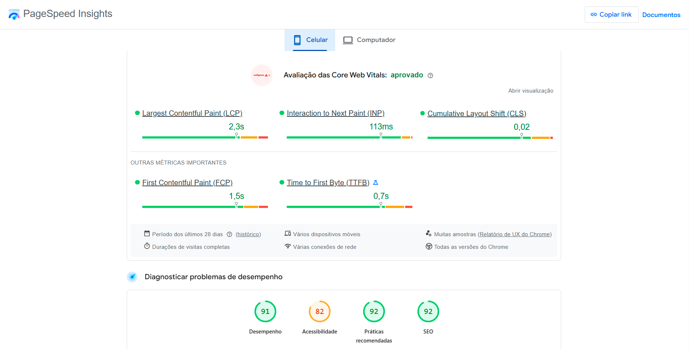

# 🧠 Case de SEO e Performance – Site Elfer | Grupo Cecil

Este projeto apresenta a análise e implementação de melhorias técnicas no site institucional da Elfer, com foco em SEO técnico, performance e rastreamento de dados.

O objetivo foi identificar e corrigir fatores que impactavam a visibilidade orgânica e a experiência do usuário.

---

## 🚨 Problema

Durante a análise inicial, foram identificados pontos críticos:

- Páginas não indexadas no Google  
- Baixa performance em dispositivos mobile  
- Problemas nas métricas de Core Web Vitals (CLS elevado)  
- Falhas no rastreamento de dados  

---

## 🔍 Diagnóstico

### 🔎 Indexação (Google Search Console)

**Análise:**
- Páginas não indexadas
- Baixa cobertura de indexação

---

### ⚡ Performance Mobile (Antes)

**Análise:**
- Core Web Vitals reprovado  
- LCP elevado (até 4.7s) → carregamento lento  
- FCP alto (até 4s) → atraso na renderização  
- Desempenho geral baixo (65–68)  

**Impacto:**
- Experiência ruim em dispositivos móveis  
- Maior taxa de abandono  
- Impacto negativo no SEO e ranking  

---

### 💻 Performance Desktop (Antes)

**Análise:**
- Core Web Vitals reprovado  
- LCP elevado (3.8s) → carregamento lento  
- FCP alto (2.9s) → atraso na renderização inicial  
- Baixo desempenho geral (68)  

**Impacto:**
- Experiência do usuário prejudicada  
- Potencial impacto negativo no ranqueamento orgânico  

---

### ⚠️ Problemas Técnicos Identificados

Principais gargalos:

- Cache ineficiente  
- Scripts bloqueando renderização  
- Problemas de carregamento de fontes  
- Layout instável (CLS)  
- Imagens não otimizadas  

---

## ⚙️ Implementação

### 🔧 Integração com Google (Site Kit)

- Integração com Google Analytics  
- Integração com Search Console  

---

### 🔍 SEO Técnico (Yoast)

- Otimização de meta tags  
- Ajustes de indexação  
- Estrutura de páginas  

---

### 📊 Rastreamento (Google Tag Manager)

- Configuração de tags  
- Validação de eventos  

---

## 📈 Resultados

### ⚡ Performance Desktop (Depois)

**Resultados:**
- Core Web Vitals aprovado  
- Performance: 94  
- LCP reduzido para 2s  
- INP: 55ms (alta responsividade)  
- CLS otimizado para 0.04  
- SEO score: 92  

**Observações:**
- Pequena oportunidade de melhoria no TTFB (1.3s)  

**Impacto:**
- Navegação mais rápida e fluida  
- Melhor experiência do usuário  
- Forte base técnica para SEO e mídia  
---

### 📱 Performance Mobile (Depois)

**Resultados:**
- Core Web Vitals aprovado  
- Performance: 91  
- LCP reduzido para 2.3s  
- FCP melhorado para 1.5s  
- CLS otimizado para 0.02  
- SEO score: 92  

**Impacto:**
- Experiência mobile significativamente melhor  
- Redução do tempo de carregamento percebido  
- Melhoria direta nos fatores de ranqueamento  

---

## 📉 Comparativo

| Métrica | Antes | Depois |
|--------|------|--------|
| Performance Mobile | 33–65 | 91 |
| Performance Desktop | 60–68 | 94 |
| CLS | 1.14 | 0.02 |
| SEO Score | 75 | 92 |

---

## 🎯 Impacto

- Aumento do potencial de ranqueamento orgânico  
- Melhor experiência do usuário  
- Redução de falhas de carregamento  
- Base técnica estruturada para marketing  

---

## ⚠️ Limitações

Não foram registrados dados quantitativos completos antes e depois.

Ainda assim, as melhorias seguem boas práticas técnicas com impacto direto em SEO e performance.

