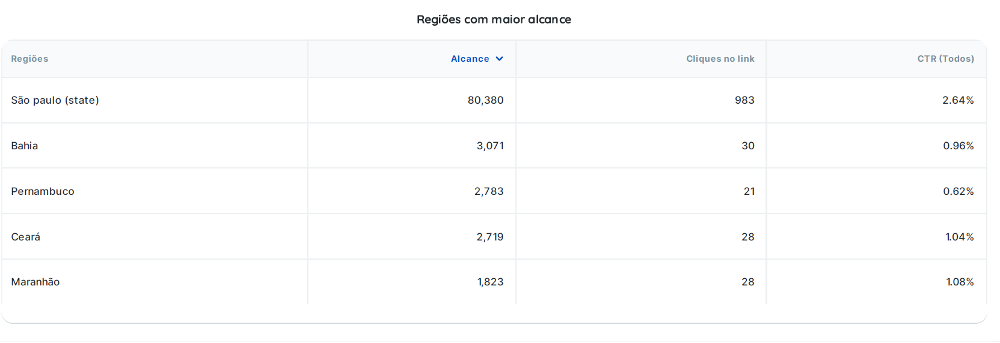
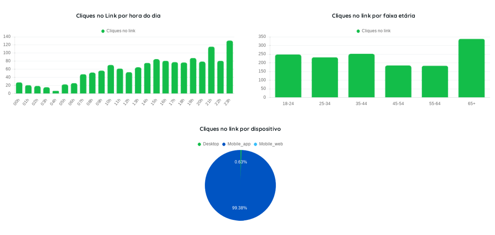
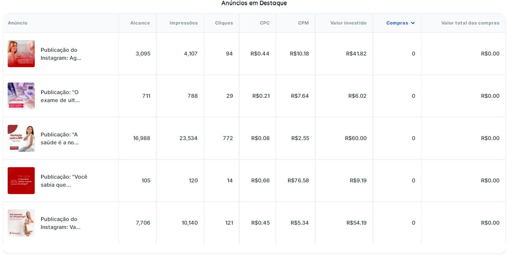
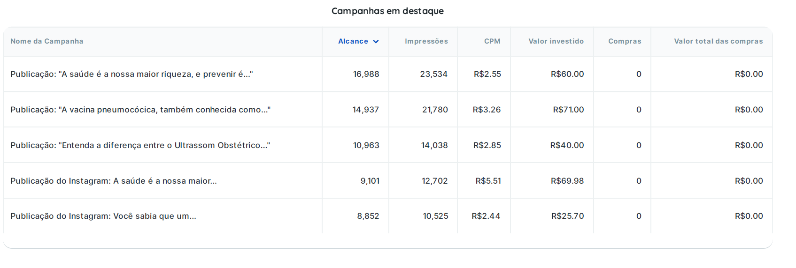
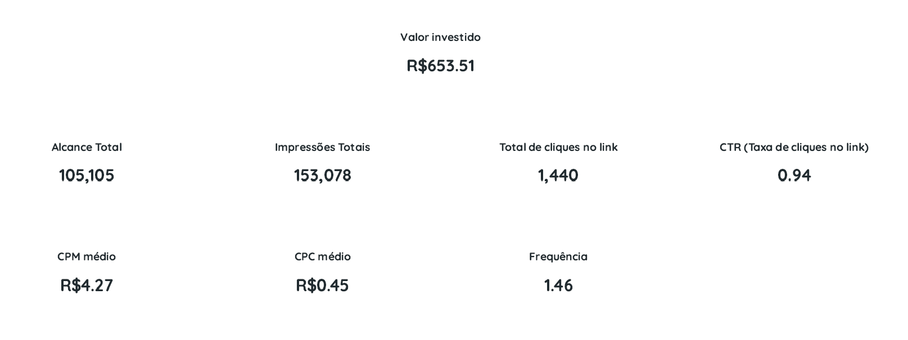

# 📱 Meta Ads — Estratégia de Aquisição  
**Cliente:** São Lucas (Serviços laboratoriais)

---

## 🎯 Objetivo
Gerar alcance e reconhecimento de marca para serviços laboratoriais, priorizando eficiência de custo e distribuição.

---

## 📊 Resultados

- **Alcance:** 105.105  
- **Impressões:** 153.078  
- **Cliques no link:** 1.440  
- **CTR:** 0,94%  
- **CPC médio:** R$0,45  
- **Investimento total:** R$653,51  
- **Frequência:** 1,46  

---

## 📈 Principais Insights

### 💰 Eficiência de Mídia
- CPC baixo indica boa otimização de campanha  
- CPM médio competitivo (R$4,27)  
- Alta capacidade de escala com baixo custo  

---

### ⚠️ Oportunidade de Melhoria
- CTR abaixo do ideal (0,94%)  
- Indica necessidade de otimização em:
  - Criativos
  - Copy
  - Segmentação

---

### 🌎 Distribuição Geográfica
- Forte concentração em São Paulo  
- Outras regiões com menor volume e menor performance  

---

### ⏰ Comportamento por Horário
- Pico de cliques no período noturno (21h–23h)  
- Oportunidade de otimização de entrega por horário  

---

### 👥 Faixa Etária
- Maior volume de cliques em público **65+**  
- Alta aderência ao tema saúde e prevenção  

---

### 📱 Dispositivo
- 99% dos acessos via mobile  
- Necessidade de criativos mobile-first  

---

## 🧪 Performance de Criativos

### 🔝 Melhor Anúncio
**"A saúde é a nossa maior riqueza..."**

- 772 cliques  
- CPC: R$0,08  

📌 Insight:  
Apelo emocional e linguagem simples geram maior engajamento  

---

### 📉 Pontos de Atenção
- Anúncios com CPC elevado (até R$0,66)  
- CPM alto em criativos menos relevantes  

📌 Insight:  
Baixa atratividade impacta diretamente o custo da mídia  

---

## 💡 Oportunidades de Otimização

### 🎨 Criativos
- Testes A/B com:
  - Apelo emocional
  - Benefício direto
  - Prova social  

---

### ✍️ Copy
- Foco em dor + solução  
- Linguagem mais direta e humanizada  

---

### 🎯 Segmentação
- Separar públicos por faixa etária  
- Refinar distribuição geográfica  
- Criar públicos de remarketing  

---

### ⚙️ Estratégia de Campanha
- Teste de horários de veiculação  
- Estruturação de funil:
  - Awareness  
  - Consideração  
  - Conversão  

---

## 🧠 Conclusão

A campanha apresentou **alta eficiência de distribuição e baixo custo**, validando o potencial de escala.

No entanto, a **taxa de cliques abaixo do ideal indica necessidade de otimização criativa**, com foco em aumentar a conversão da atenção gerada.

---

## 🖼️ Evidências Visuais

### 📍 Regiões com maior alcance

---

### ⏰ Cliques por horário

---

### 📢 Anúncios em destaque

---

### 📊 Campanhas em destaque

---

### 📌 Visão geral da campanha

