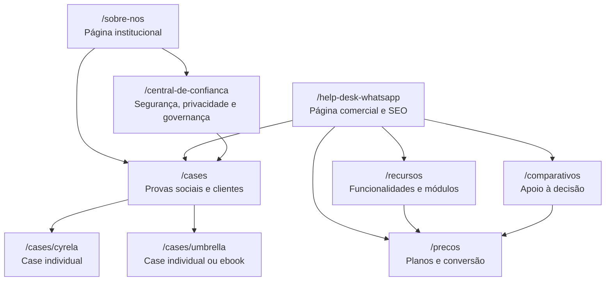

# Reestruturação da Arquitetura de Páginas do Site Milvus

Case de portfólio sobre arquitetura de informação, SEO técnico e estruturação de páginas estratégicas para um site B2B SaaS.

## Visão Geral

Projeto de reorganização estratégica de páginas institucionais e comerciais do site da Milvus, com foco em clareza de jornada, intenção de busca, prova social, suporte ao amadurecimento de segurança da informação e melhoria da experiência de avaliação comercial.

O trabalho partiu da necessidade de atualizar a página institucional da Milvus e evoluiu para uma proposta maior de divisão da arquitetura do site, incluindo páginas de confiança, Help Desk com WhatsApp, cases, preços, comparativos e recursos.

## Objetivo

Estruturar uma arquitetura mais clara e escalável para páginas institucionais, comerciais, educativas e de prova social, permitindo que cada página tenha um papel específico dentro da jornada do usuário e da estratégia de SEO.

## Contexto

A página institucional concentrava temas com objetivos diferentes, como história da empresa, segurança, produto, autoridade e cases. Isso dificultava a leitura estratégica da marca, reduzia o potencial de ranqueamento por temas específicos e deixava provas sociais importantes dispersas.

Com o processo de evolução em segurança e governança, especialmente relacionado à ISO/IEC 27001, também se tornou necessário separar melhor os conteúdos de confiança, privacidade e compliance.

Em paralelo, foram idealizadas novas páginas comerciais e de apoio à decisão, como preços, comparativos e recursos, para melhorar a experiência de usuários em fase de avaliação, comparação e compra.

## Meu Papel

Atuei na análise estratégica, diagnóstico de arquitetura, organização das páginas, definição de dobras, direcionamento de SEO técnico e estruturação de briefing para redação, design e desenvolvimento.

Principais responsabilidades:

- diagnosticar a página institucional existente;
- mapear oportunidades de arquitetura e SEO;
- separar páginas por intenção de busca;
- definir dobras e blocos relevantes;
- propor links internos entre páginas;
- organizar insumos de cases, vídeos e materiais ricos;
- estruturar páginas comerciais de decisão, como preços e comparativos;
- organizar uma página de recursos para aprofundamento do produto;
- estruturar recomendações para CMS, tracking e validação interna.

## Problema Identificado

A estrutura anterior concentrava temas demais em uma única página, gerando:

- baixa clareza sobre o papel da página institucional;
- dificuldade para ranquear termos específicos;
- pouca separação entre conteúdo institucional, comercial e técnico;
- baixo aproveitamento de cases e depoimentos;
- ausência de uma página dedicada à confiança e segurança;
- ausência de páginas específicas para preços, comparação e aprofundamento de recursos;
- menor eficiência para orientar redatores, designers e desenvolvedores.

## Antes e Depois

### Antes

A página institucional funcionava como um ponto único para diversos temas: história da empresa, apresentação da plataforma, segurança, confiança, autoridade, clientes e conversão comercial.

```text
/sobre-nos
  História da empresa
  Cultura
  Visão geral do produto
  Segurança e governança
  Clientes e provas sociais
  Chamadas comerciais
```

Principais limitações:

- muitos assuntos competindo na mesma página;
- dificuldade para destacar temas estratégicos como segurança e ISO;
- menor potencial de SEO para buscas específicas;
- provas sociais pouco exploradas;
- jornada menos clara para diferentes públicos;
- dependência de uma única página para responder dúvidas institucionais, técnicas e comerciais.

### Depois

A nova proposta separa os temas por papel estratégico, criando páginas mais focadas e conectadas entre si.

```text
/sobre-nos
  Institucional, marca, história e cultura

/central-de-confianca
  Segurança, privacidade, governança, LGPD e ISO/IEC 27001

/help-desk-whatsapp
  Página comercial e SEO para demanda de Help Desk com WhatsApp

/cases
  Provas sociais, clientes, vídeos, ebooks e depoimentos

/precos
  Planos, pacotes, critérios comerciais e orientação de escolha

/comparativos
  Comparação entre Milvus, alternativas e critérios de decisão

/recursos
  Central de funcionalidades, módulos e capacidades do produto
```

Principais ganhos:

- cada página passa a ter uma intenção clara;
- melhor distribuição de conteúdo por etapa da jornada;
- maior potencial de ranqueamento orgânico;
- segurança e confiança deixam de ser um bloco secundário;
- cases passam a funcionar como ativo estratégico de conversão;
- o site fica mais fácil de evoluir, medir e otimizar.

### Comparativo Estratégico

| Tema | Antes | Depois |
| --- | --- | --- |
| Institucional | Concentrado em uma página com muitos assuntos | Página Sobre Nós focada em marca, história e posicionamento |
| Segurança | Tratada como bloco dentro da página institucional | Central de Confiança dedicada à segurança, LGPD, governança e ISO |
| SEO comercial | Páginas dispersas ou sobrepostas | Página específica para Help Desk com WhatsApp |
| Prova social | Cases e depoimentos pouco centralizados | Página de Cases com filtros, vídeos, ebooks e clientes |
| Jornada do usuário | Menos segmentada | Fluxos claros por interesse: empresa, segurança, produto ou clientes |
| Conteúdo | Difícil de expandir sem sobrecarregar páginas | Estrutura modular, mais fácil de atualizar |
| Tracking | Conversões e interações menos organizadas por tema | Eventos por página, CTA, case, vídeo, ebook e filtro |

## Solução Proposta

A solução foi dividir a arquitetura em páginas principais, cada uma com objetivo próprio.

| Página | Papel Estratégico | Intenção Principal |
| --- | --- | --- |
| Sobre a Milvus | Institucional | Apresentar empresa, história, cultura, maturidade e posicionamento |
| Central de Confiança | Segurança e governança | Organizar informações sobre ISO, LGPD, privacidade, controles e compliance |
| Help Desk com WhatsApp | Comercial e SEO | Capturar demanda por atendimento via WhatsApp integrado a tickets |
| Cases Milvus | Prova social | Reunir cases, depoimentos, vídeos, ebooks e avaliações de clientes |
| Preços | Conversão comercial | Ajudar usuários a entender planos, critérios de contratação e próximo passo |
| Comparativos | Decisão e BOFU | Apoiar usuários que estão comparando soluções antes de contratar |
| Recursos | Produto e educação | Explicar funcionalidades, módulos e capacidades da plataforma |

## Links, Objetivos e Resultados por Página

> Observação: os links abaixo representam a página existente e as rotas propostas para a nova arquitetura. As URLs finais podem ser ajustadas conforme padrão do site e decisão do time de desenvolvimento.

| Página | Link/rota | Objetivo | Resultado esperado |
| --- | --- | --- | --- |
| Sobre a Milvus | https://milvus.com.br/sobre-nos | Reposicionar a página institucional como espaço de marca, história, cultura e credibilidade. | Página mais clara, com menos sobrecarga de temas técnicos e melhor direcionamento para páginas de apoio. |
| Central de Confiança | https://milvus.com.br/central-de-confianca | Concentrar informações sobre segurança, privacidade, LGPD, governança e processo relacionado à ISO/IEC 27001. | Reduzir fricção em processos comerciais, compras, jurídico e segurança da informação. |
| Help Desk com WhatsApp | https://milvus.com.br/help-desk-whatsapp | Capturar demanda orgânica e comercial de usuários que buscam atendimento via WhatsApp integrado a chamados. | Aumentar potencial de SEO e conversão em uma dor específica e altamente comercial. |
| Cases Milvus | https://milvus.com.br/cases | Centralizar provas sociais, cases, depoimentos, vídeos, ebooks e avaliações externas validadas. | Transformar clientes e histórias reais em ativos de autoridade, conversão e suporte a vendas. |
| Case Cyrela | https://milvus.com.br/cases/cyrela | Apresentar um caso de uso com foco em atendimento a corretores, WhatsApp, chamados e redução de TMA/TME. | Apoiar páginas comerciais com prova real de uso e resultado operacional. |
| Case Umbrella | https://milvus.com.br/cases/umbrella | Explorar um case com foco em centralização, rastreabilidade, LGPD, governança e redução de ferramentas. | Conectar prova social a temas de confiança, segurança e Service Desk. |
| Preços | https://milvus.com.br/precos| Facilitar a avaliação comercial com planos, critérios de escolha, perguntas frequentes e CTA de proposta. | Melhorar conversão de usuários em fase de comparação e reduzir dúvidas recorrentes do funil. |
| Comparativos | https://milvus.com.br/comparativo | Apoiar usuários que estão comparando a Milvus com alternativas, planilhas, ferramentas legadas ou concorrentes. | Capturar buscas de decisão e fortalecer argumentos comerciais de diferenciação. |
| Recursos | https://milvus.com.br/recursos | Organizar funcionalidades, módulos e capacidades da plataforma em uma central clara e navegável. | Melhorar descoberta de produto, links internos e cauda longa de SEO. |

## Arquitetura Recomendada

```text
/sobre-nos
  Página institucional principal

/central-de-confianca
  Página de segurança, privacidade e governança

/help-desk-whatsapp
  Página comercial orientada a SEO

/cases
  Central de cases e provas sociais

/cases/cyrela
  Case individual

/cases/umbrella
  Case individual ou landing page de ebook

/precos
  Página de planos, condições comerciais e orientação para escolha

/comparativos
  Página hub para comparações e critérios de decisão

/recursos
  Página hub de funcionalidades, módulos e capacidades da plataforma
```

## Visão das Páginas

A proposta abaixo mostra como as páginas se conectam dentro da nova arquitetura.



### Wireframe Textual: Sobre a Milvus

```text
[Hero institucional]
  Posicionamento da empresa + CTA

[Credibilidade]
  Números, logos ou selos validados

[Quem é a Milvus]
  História, mercado e proposta institucional

[Essência e cultura]
  Valores, jeito de trabalhar e visão de futuro

[Visão geral da plataforma]
  O que a Milvus resolve, sem transformar a página em página de produto

[Segurança e governança]
  Resumo curto + link para Central de Confiança

[Empresas que confiam]
  Logos ou chamadas para cases

[Linha do tempo]
  Marcos da empresa

[FAQ institucional]
  Dúvidas sobre empresa, produto e atendimento

[CTA final]
  Falar com especialista ou conhecer a plataforma
```

### Wireframe Textual: Central de Confiança

```text
[Hero de confiança]
  Mensagem de segurança, governança e compromisso

[Compromisso com segurança]
  Políticas, processos e responsabilidade

[ISO/IEC 27001]
  Status cuidadoso: processo, evolução ou alinhamento

[Privacidade e LGPD]
  Tratamento de dados, direitos e responsabilidades

[Controles de segurança]
  Acesso, logs, permissões, continuidade e proteção

[Infraestrutura e disponibilidade]
  Backup, estabilidade, monitoramento e resposta

[Documentos e políticas]
  Materiais para clientes, jurídico e compras

[FAQ de segurança]
  Respostas para dúvidas comerciais e técnicas

[CTA final]
  Solicitar informações de segurança
```

### Wireframe Textual: Help Desk com WhatsApp

```text
[Hero comercial]
  Help Desk com WhatsApp integrado a chamados

[Dor principal]
  Conversas perdidas, falta de histórico e ausência de SLA

[Como funciona]
  WhatsApp vira chamado com histórico e responsável

[Operação de atendimento]
  Filas, prioridades, agentes, SLA e escalonamento

[Automação]
  Chatbot, IA, respostas padrão e fluxos automatizados

[Omnichannel]
  Centralização de canais e continuidade do atendimento

[Indicadores]
  TMA, TME, produtividade e relatórios

[Provas sociais]
  Cases relacionados, como Cyrela e Umbrella

[FAQ comercial]
  Perguntas sobre implantação, integração e uso

[CTA final]
  Solicitar demonstração
```

### Wireframe Textual: Cases Milvus

```text
[Hero da central de cases]
  Clientes reais, resultados e histórias de uso

[Credibilidade]
  Logos, números e segmentos validados

[Cases em destaque]
  Cyrela, Umbrella, Dominit IT e Officer Shop

[Material rico]
  Ebook da Umbrella ou outros conteúdos aprofundados

[Depoimentos em vídeo]
  Vídeos de usuários/clientes

[Filtros]
  Segmento, solução e tipo de conteúdo

[Grid de cases]
  Cards com resumo, segmento, solução e CTA

[Depoimentos curtos]
  Frases de usuários e avaliações externas validadas

[CTA final]
  Conversar com vendas ou conhecer a plataforma
```

### Wireframe Textual: Preços

```text
[Hero de preços]
  Proposta clara para avaliar planos ou solicitar proposta

[Resumo dos planos]
  Cards com opções, público indicado e principais diferenças

[Comparação de recursos por plano]
  Tabela objetiva com funcionalidades incluídas

[Orientação de escolha]
  Qual plano faz sentido para cada tipo de operação

[Perguntas comerciais]
  Implantação, usuários, canais, suporte, integrações e contratos

[Provas de confiança]
  Cases, logos ou depoimentos relacionados à decisão de compra

[CTA final]
  Solicitar proposta ou falar com especialista
```

### Wireframe Textual: Comparativos

```text
[Hero de comparativos]
  Ajuda para comparar alternativas de Help Desk, Service Desk e atendimento

[Critérios de decisão]
  Atendimento, canais, SLA, automação, relatórios, integrações e segurança

[Comparativos em destaque]
  Milvus vs alternativas, modelos de planilha ou soluções legadas

[Tabela comparativa]
  Recursos, diferenciais, limitações e melhor uso

[Quando escolher a Milvus]
  Cenários onde a plataforma tem maior aderência

[Provas sociais]
  Cases conectados aos critérios de escolha

[CTA final]
  Ver demonstração ou falar com especialista
```

### Wireframe Textual: Recursos

```text
[Hero de recursos]
  Visão geral das funcionalidades e módulos da plataforma

[Categorias de recursos]
  Help Desk, Service Desk, WhatsApp, Omnichannel, Automação, SLA, Relatórios e Integrações

[Grid de funcionalidades]
  Cards com resumo, benefício e link para aprofundamento

[Fluxos de uso]
  Como os recursos se conectam na operação

[Recursos por necessidade]
  Atendimento, produtividade, controle, gestão e experiência do usuário

[Conteúdos relacionados]
  Cases, artigos, materiais ricos e páginas comerciais

[CTA final]
  Conhecer a plataforma ou solicitar demonstração
```

## Página Sobre a Milvus

Objetivo: manter a página institucional mais clara, leve e confiável, sem concentrar temas técnicos que merecem páginas próprias.

Dobras recomendadas:

1. Hero institucional
2. Barra de credibilidade
3. Quem é a Milvus
4. Essência, cultura e posicionamento
5. Visão geral da plataforma
6. Bloco resumido de segurança com link para a Central de Confiança
7. Empresas que confiam na Milvus com link para Cases
8. Linha do tempo
9. Cultura e carreiras
10. FAQ institucional
11. CTA final

## Central de Confiança

Objetivo: criar uma página própria para segurança, privacidade, governança e maturidade dos controles internos.

Dobras recomendadas:

1. Hero de confiança e segurança
2. Compromisso com governança
3. Processo relacionado à ISO/IEC 27001
4. Privacidade e LGPD
5. Controles de segurança
6. Infraestrutura, disponibilidade e continuidade
7. Documentos e políticas
8. FAQ de segurança
9. CTA para solicitar informações de segurança

Observação: a página deve evitar afirmar certificação ISO antes da conclusão oficial. A redação deve usar termos como "em processo", "em evolução" ou "alinhado a boas práticas".

## Help Desk com WhatsApp

Objetivo: criar uma página comercial orientada a conversão e SEO para usuários que buscam atendimento via WhatsApp integrado a processos de Help Desk.

Dobras recomendadas:

1. Hero com proposta de valor
2. Dor principal: conversas perdidas, falta de histórico e atendimento descentralizado
3. Como o WhatsApp vira chamado
4. Filas, responsáveis, prioridades e SLA
5. Atendimento com múltiplos agentes
6. Histórico centralizado e rastreável
7. Chatbot, IA e automação
8. Omnichannel e integrações
9. Dashboards e indicadores
10. Provas sociais e cases relacionados
11. FAQ comercial
12. CTA de demonstração

Páginas que podem fornecer ou migrar conteúdos:

- página atual de WhatsApp;
- página de sistema de chamados Help Desk;
- página de plataforma omnichannel;
- página de chatbot ou automação;
- cases Cyrela e Umbrella como provas de uso.

## Cases Milvus

Objetivo: consolidar provas sociais da Milvus em uma página central, conectando cases completos, depoimentos em vídeo, ebooks e avaliações externas.

Dobras recomendadas:

1. Hero da central de cases
2. Barra de credibilidade com logos e números validados
3. Cases em destaque
4. Bloco de materiais ricos, como ebook da Umbrella
5. Depoimentos em vídeo
6. Filtros por segmento, solução e tipo de conteúdo
7. Grid de cases
8. Depoimentos curtos de usuários
9. Avaliações externas, se houver autorização
10. CTA para falar com vendas ou ver demonstração

## Cases Considerados

| Case | Formato | Uso Recomendado |
| --- | --- | --- |
| Cyrela | Case completo | Destaque em Help Desk com WhatsApp e página de Cases |
| Umbrella GRC & Security | Case completo + ebook | Destaque em Central de Confiança, LGPD e página de Cases |
| Dominit IT | Case/depoimento a validar | Card de prova social ou case individual |
| Officer Shop | Case/depoimento a validar | Card de prova social ou case individual |
| Vídeos Anderson, Nayara e Renata | Depoimentos em vídeo | Bloco de vídeos na página de Cases |
| Avaliações externas | Depoimentos curtos | Bloco de prova social, com validação de fonte e permissão |

## Recomendações de SEO

- separar páginas por cluster semântico;
- evitar que a página institucional tente ranquear para todos os temas;
- criar página específica para Help Desk com WhatsApp;
- criar página específica para Central de Confiança;
- criar página específica para Preços com foco em conversão e avaliação comercial;
- criar hub de Comparativos para usuários em fase final de decisão;
- criar hub de Recursos para organizar funcionalidades e fortalecer cauda longa de SEO;
- usar URLs claras, curtas e descritivas;
- estruturar H1 único por página;
- usar H2s orientados a dúvidas, benefícios e intenções de busca;
- criar links internos entre páginas relacionadas;
- aplicar schema quando fizer sentido;
- evitar claims sem validação, principalmente em segurança, ISO e métricas de cases.

## Recomendações de Tracking

Eventos recomendados:

- clique em CTA principal;
- clique em solicitar demonstração;
- clique em falar com especialista;
- abertura de vídeo de depoimento;
- download de ebook;
- filtro aplicado na página de cases;
- clique em case individual;
- clique em documento ou política de segurança;
- clique em plano ou card de preço;
- clique em comparativo;
- clique em recurso ou módulo;
- envio de formulário;
- clique em WhatsApp, se houver.

## Cuidados de Conteúdo

Pontos que precisam ser validados antes da publicação:

- status oficial da ISO/IEC 27001;
- autorização para uso de logos;
- autorização para uso de vídeos e depoimentos;
- métricas comerciais e operacionais;
- nomes, cargos e empresas dos depoentes;
- permissão para citar avaliações externas;
- informações técnicas de segurança, privacidade e infraestrutura;
- padronização do nome da marca e do produto.

## Entregáveis

- diagnóstico da página institucional;
- proposta de nova arquitetura de páginas;
- briefing estrutural da página Sobre a Milvus;
- briefing estrutural da Central de Confiança;
- briefing estrutural da página Help Desk com WhatsApp;
- briefing estrutural da página de Cases;
- briefing estrutural da página de Preços;
- briefing estrutural da página de Comparativos;
- briefing estrutural da página de Recursos;
- organização de cases e ativos disponíveis;
- recomendações de SEO técnico;
- recomendações de tracking;
- checklist para desenvolvimento, redação e validação interna.

## Resultado Esperado

Com a nova arquitetura, o site passa a ter páginas mais específicas, claras e competitivas.

Benefícios esperados:

- melhor organização da jornada do usuário;
- maior potencial de ranqueamento orgânico;
- maior clareza institucional;
- mais autoridade em segurança e governança;
- melhor aproveitamento de cases e depoimentos;
- páginas mais fáceis de manter e evoluir;
- jornada comercial mais completa para usuários em avaliação, comparação e decisão.

## Resultados Obtidos

Como resultado do projeto, foi criada uma base estratégica para evolução das páginas do site, com entregáveis prontos para orientar os próximos passos de conteúdo, design e desenvolvimento.

Resultados diretos:

- arquitetura reorganizada em frentes institucionais, comerciais, educativas e de prova social;
- separação clara entre conteúdos de marca, segurança, produto e prova social;
- definição de novas URLs estratégicas para o site;
- mapeamento das dobras recomendadas para cada página;
- identificação de conteúdos que deveriam migrar ou se desdobrar em novas páginas;
- criação de uma estrutura dedicada para Central de Confiança;
- criação de uma estrutura dedicada para Help Desk com WhatsApp;
- criação de uma estrutura para página de Cases com filtros, vídeos, ebooks e depoimentos;
- inclusão das páginas de Preços, Comparativos e Recursos como apoio à conversão e decisão comercial;
- organização dos cases Cyrela, Umbrella, Dominit IT e Officer Shop dentro da nova arquitetura;
- definição de pontos de validação para evitar claims sensíveis sobre ISO, segurança e métricas;
- recomendações de SEO técnico, links internos, schema e tracking.

Resultados para o time:

- briefing pronto para redação;
- direcionamento claro para design;
- escopo mais objetivo para desenvolvimento;
- checklist de validação para marketing, produto, segurança e jurídico;
- base reutilizável para futuras páginas comerciais e institucionais.

Impacto estratégico esperado após implementação:

- aumento da clareza da jornada do usuário;
- maior potencial de tráfego orgânico qualificado;
- melhor suporte a conversões comerciais;
- fortalecimento da percepção de confiança e maturidade da marca;
- melhor aproveitamento de provas sociais em páginas comerciais;
- maior facilidade de medir interações relevantes por página.

### Resultados por Frente

| Frente | Resultado obtido no planejamento | Impacto para o projeto |
| --- | --- | --- |
| Arquitetura institucional | Separação entre página Sobre Nós e páginas de apoio. | A marca passa a ter uma narrativa mais limpa, sem misturar todos os assuntos em uma única página. |
| Segurança e confiança | Criação da proposta de Central de Confiança. | O tema ganha profundidade própria e pode apoiar conversas comerciais, jurídicas e de compliance. |
| Help Desk com WhatsApp | Definição de uma página específica para uma dor comercial clara. | Aumenta o potencial de captação orgânica e melhora a conexão entre problema, solução e conversão. |
| Cases | Organização de clientes, ebooks, vídeos e depoimentos em uma central única. | As provas sociais deixam de ficar dispersas e passam a apoiar páginas comerciais e institucionais. |
| Preços | Inclusão de uma página de decisão comercial. | Usuários em fase de avaliação encontram critérios de escolha e próximo passo com menos fricção. |
| Comparativos | Inclusão de um hub para comparação de alternativas. | A marca passa a disputar buscas de fundo de funil e usuários em momento de decisão. |
| Recursos | Inclusão de uma central de funcionalidades e módulos. | O produto fica mais fácil de explorar e a arquitetura ganha novas oportunidades de links internos. |
| SEO técnico | Organização por clusters, rotas, H1/H2, schema e links internos. | O site passa a ter páginas mais específicas para competir em diferentes intenções de busca. |
| Tracking | Mapeamento de eventos por página, CTA, vídeo, ebook, filtro, recurso e comparativo. | A performance das novas páginas pode ser medida com mais clareza depois da implementação. |

## Aprendizados

Este projeto reforçou a importância de tratar arquitetura de páginas como uma decisão estratégica, não apenas visual.

Separar corretamente as intenções de busca permite que cada página tenha um papel mais forte: a institucional constrói marca, a Central de Confiança reduz fricção, a página de Help Desk com WhatsApp captura demanda comercial e a página de Cases transforma provas reais em autoridade.

## Status

Briefing estruturado e pronto para seguir para redação, design e desenvolvimento.


