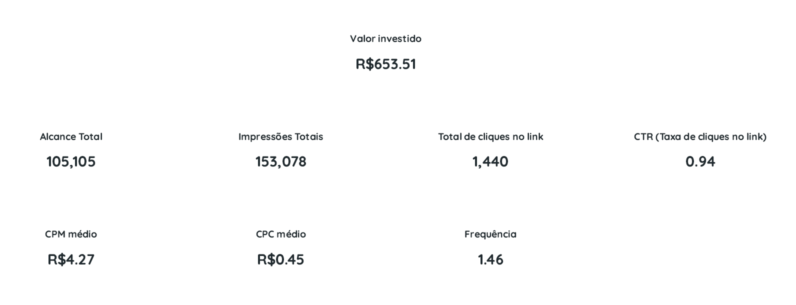
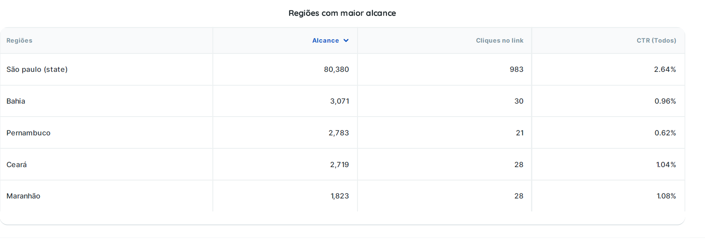
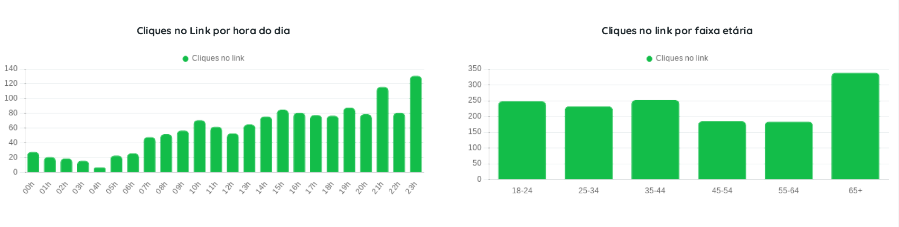
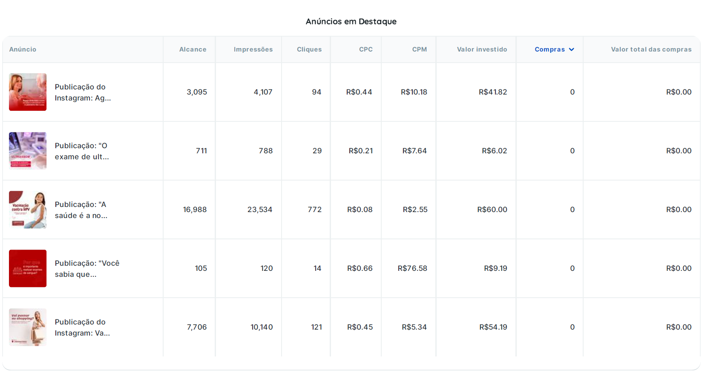
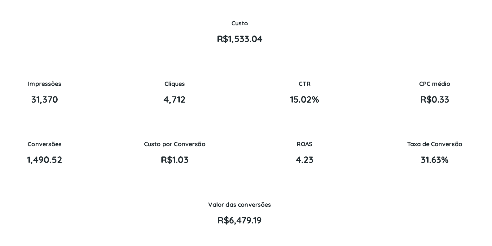
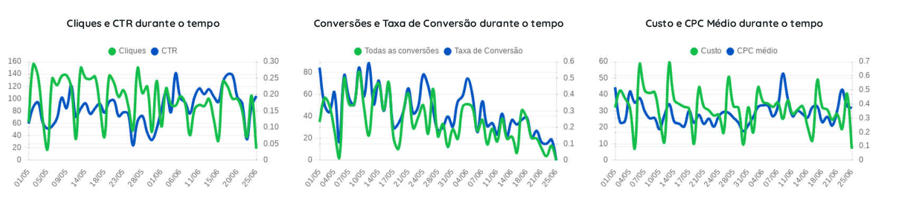
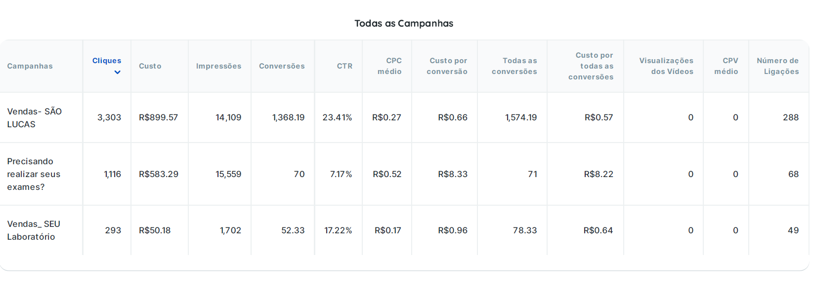
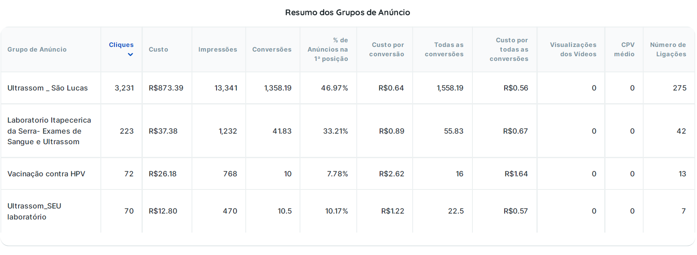
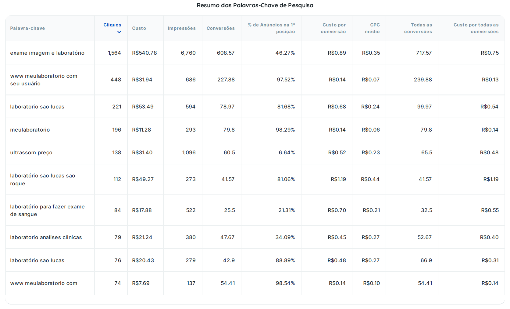
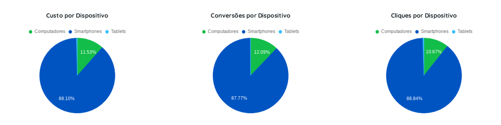

# 📊 Meta Ads e Google Ads — São Lucas
**Meta Ads + Google Ads | São Lucas e Seu Laboratório**

---

## 🧠 Contexto

Este projeto apresenta a análise de desempenho de campanhas de mídia paga no setor de saúde, com foco em:

- Alcance e reconhecimento  
- Geração de tráfego  
- Conversão de usuários  
- Eficiência de investimento  

A análise integra dados de **Meta Ads e Google Ads**, permitindo visão completa do funil.

---

## 🎯 Objetivo

Avaliar a performance das campanhas e identificar oportunidades de otimização em:

- Segmentação  
- Eficiência de mídia  
- Conversão  
- Estrutura de campanhas  

---

## 🛠️ Ferramentas

- Meta Ads  
- Google Ads  
- Google Analytics  

---

# 📱 Meta Ads — Awareness & Tráfego

## 📊 Resultados

- **Investimento:** R$653,51  
- **Alcance:** 105.105  
- **Impressões:** 153.078  
- **Cliques:** 1.440  
- **CTR:** 0,94%  
- **CPC médio:** R$0,45  

---

### 🖼️ Evidência — Performance Meta Ads

---

## 🔍 Análise

- Alto alcance com baixo custo  
- Boa eficiência de entrega  
- CTR abaixo do ideal  

📌 Insight:  
Meta Ads atuou como canal de topo de funil (awareness).

---

### 🖼️ Evidência — Criativos

---

# 🔎 Google Ads — Conversão & Performance

## 📊 Resultados

- **Investimento:** R$1.533,04  
- **Impressões:** 31.370  
- **Cliques:** 4.712  
- **CTR:** 15,02%  
- **CPC médio:** R$0,33  

---

## 💰 Conversão

- **Conversões:** 1.490  
- **Taxa de conversão:** 31,63%  
- **Custo por conversão:** R$1,03  
- **ROAS:** 4,23  

---

### 🖼️ Evidência — Performance Geral

---

## 🔍 Análise

- Alto CTR → forte intenção de busca  
- Alta taxa de conversão  
- Baixo custo por aquisição  

📌 Insight:  
Google Ads atuou como canal de fundo de funil.

---

### 🖼️ Evidência — Conversões

---

## 🔑 Palavras-chave

- Termos relacionados a exames → maior volume  
- Termos de marca → maior conversão  

---

### 🖼️ Evidência — Keywords

---

## 📱 Dispositivos

- Predominância de mobile nas conversões  

---

### 🖼️ Evidência — Dispositivos

---

# 🔗 Estratégia Integrada

- Meta Ads → gera demanda  
- Google Ads → captura intenção  

👉 Estrutura de funil:
- Awareness  
- Consideração  
- Conversão  

---

# 💡 Insights Estratégicos

- Conteúdos educativos performam melhor no Meta  
- Palavras-chave de intenção direta convertem mais  
- Mobile é dominante  
- Marca tem alto poder de conversão  

---

# ⚠️ Oportunidades de Otimização

### 🎯 Segmentação
- Refinar geolocalização  
- Ajustar faixas etárias  

---

### 🎨 Criativos (Meta)
- Testes A/B  
- Copy mais orientada à dor  

---

### 🔍 Google Ads
- Expandir palavras-chave  
- Negativar termos irrelevantes  
- Ajustar lances  

---

### ⏰ Entrega
- Otimizar horários  

---

# 📈 Impacto

- Melhor alocação de investimento  
- Aumento do potencial de conversão  
- Base estratégica para decisões  

---

# 🧠 Conclusão

A estratégia demonstrou eficiência na integração entre canais, conectando geração de demanda (Meta Ads) com captura de intenção (Google Ads).

Os resultados evidenciam uma operação orientada a dados, com potencial de escala e otimização contínua.

---

# 🚀 Próximos Passos

- Testes A/B de criativos  
- Expansão de palavras-chave  
- Integração com CRM  
- Otimização contínua baseada em conversão  

